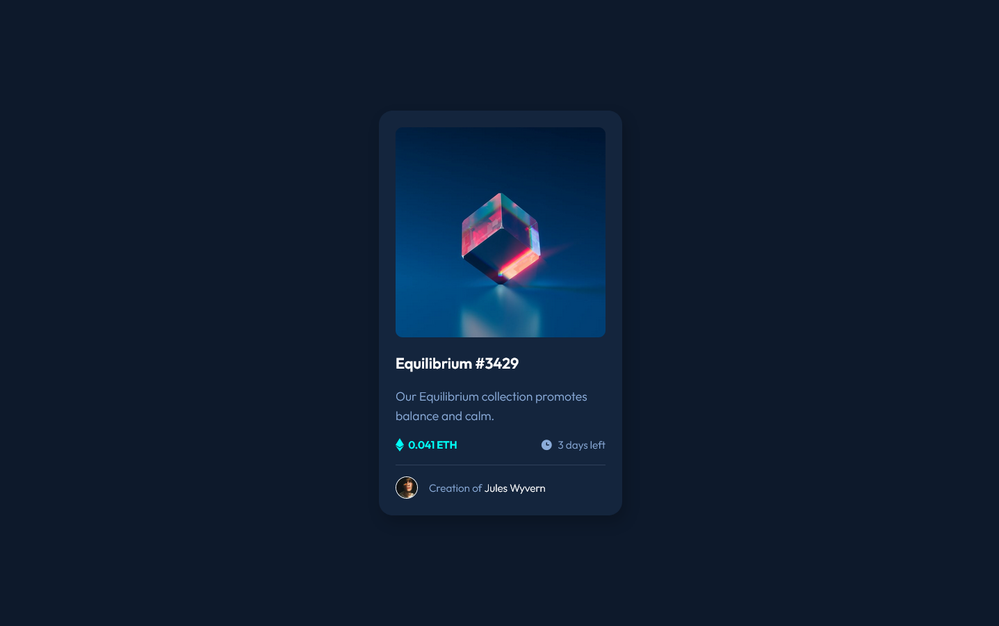

# Frontend Mentor - NFT preview card component solution

This is a solution to the [NFT preview card component challenge on Frontend Mentor](https://www.frontendmentor.io/challenges/nft-preview-card-component-SbdUL_w0U).

## Table of contents

- [Overview](#overview)
  - [The challenge](#the-challenge)
  - [Screenshot](#screenshot)
  - [Links](#links)
  - [Built with](#built-with)
  - [What I learned](#what-i-learned)
- [Author](#author)

## Overview

### The challenge

Users should be able to:

- View the optimal layout depending on their device's screen size
- See hover states for interactive elements

### Screenshot

### Links

- Solution URL: [https://github.com/lidiakrajewska/nft-preview-card-component](https://github.com/lidiakrajewska/nft-preview-card-component)
- Live Site URL: [https://lidiakrajewska.github.io/nft-preview-card-component/](https://lidiakrajewska.github.io/nft-preview-card-component/)

### Built with

- Semantic HTML5 markup
- SASS
- Flexbox

## Author

- LinkedIn - [Lidia Krajewska](https://www.linkedin.com/in/lidia-krajewska-02512a1a7/)
- Frontend Mentor - [@lidiakrajewska](https://www.frontendmentor.io/profile/lidiakrajewska)
